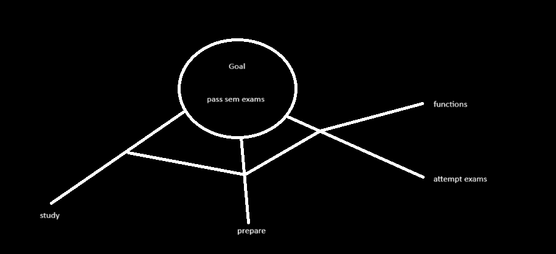

What is operating system?

**Intermediatory** - It acts as an intermediary between user 7 hardware

**Resource manager/Allocator** - Operating system controls and coordinates the use of system resources among various application programs in an unbiased fashion.

**Platform** - Operating system provides platform on which other applications can be installed, provided the environment within which programs are executed.

e.g.:
    windows, mac, android, linux, ubuntu, etc.

**Goals and Functions of operating system**

- Goals are the ultimate destination, but we follow functions to implement it.

Goals of operating system:

1. Primary goal - Convenience/user friendly
2. Secondary goals - Using resources in efficient manner, reliability, maintainability

Functions of operating system:

Process management
Memory management
I/O device management
File management
Network management
Security & protection

Major components of operating system:

1. Kernel
    - **Central component**: Manages the system's resources and communication between hardware and software.

2. Process management
    - **Process scheduler**: Determines the execution of process.
    - **Process control block (PCB)**: Contains process details such as process ID, priority, status, etc.
    - **Concurrency control**: Manages simultaneous execution.

3. Memory management
    - **Physical memory management**: Manages RAM allocation.
    - **Virtual memory management**: Simulates additional memory using disk space.
    - **Memory allocation**: Assigns memory to different process.

4. File system management
    - **File handling**: Manages the creation, deletion and access of files and directories.
    - **File control block**: Stores file attributes and control information.
    **Disk scheduling**: Organizes the order of reading on writing to disk.

5. Device management:
    - **Device drivers**: Interface between the hardware and the operating system.
    - __I/O controllers__: Manage data transfer to and from peripheral devices.

6. Security and access control:
    - __Authentication__: Verifies user credentials
    - **Authorization**: Controls access permissions to files and directories.
    - **Encryption**: Ensures data confidentiality and integrity.

7. User interface:
    - **Command line interface (CLI)**: Text-based user interaction.
    - **Graphical user interface**: Visual user-friendly interaction with the OS.

8. Networking:
    - **Network protocols**: Rules for communication between devices on a network.
    - **Network interface**: Manages connection between the computer adn the network.